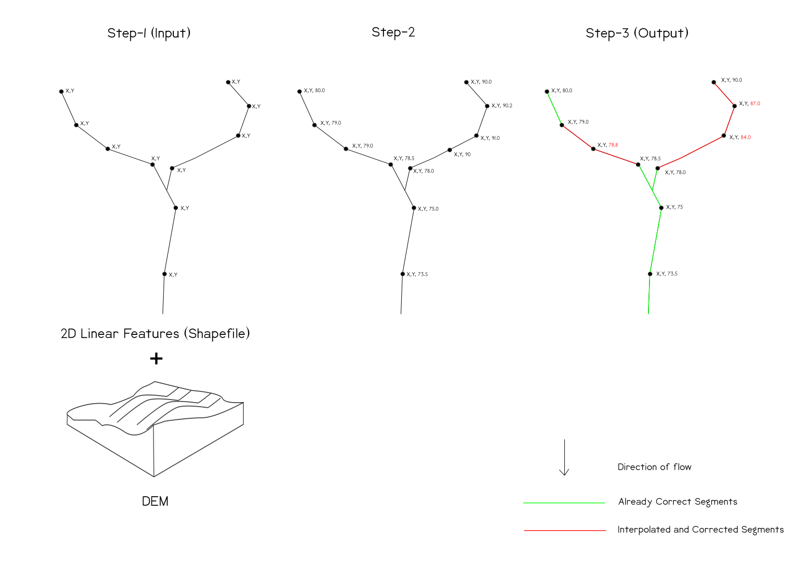

# RiverCorrection
### A Small Script to Enforce a Steady Downhill Gradient Along a (River) Polyline Data (Shapefile)

## 1. Introduction
This code is to enforce a steady downhill gradient to maintain consistency in the flow of (rivers) or other utility lines' polyline data. All previous data preparation steps for example the horizontal adjustment and direction of flow are not considered. Therefore, this code will get the z-values or the vertices from the Digital Elevation Model (DEM), and after that, it will immediately propagate downstream and look for a steady decrease of the z component in the vertex z-coordinates. If not so, it will modify the inconsistent section, typically using a linear interpolation. To make this modification very clear to the user, it will split the modified sections from the unmodified ones and add a modifier flag to the attribute table.

## 2. What it does?
Upgrade from 2D (river) polylines to 3D (river) polylines by z interpolation. Propagate downstream from the highest source point. Wherever the water flows uphill according to the data, this section must be lowered assuming a steady slope. The altered section is split from the rest and flagged as interpolated/corrected.

## 3. How to use it?
The input folder with sample data is provided that has two subfolders one for the shapefile and the other for the DEM. Put your DEM and Shapefile in these folders. After running the program when you are asked to “Please select the folder containing the input data:” navigate to the “Step1_InputData” select this folder with a single click and press “Select Folder”.

## 4. Approach
The code will take a DEM and a Two-Dimensional (2D) polyline file with initial adjustment e.g., direction of flow, already performed and will enforce the downhill gradient along a particular (river) polyline. A new 3D file with already correct and corrected flag segments will be written back to the disc.

## 5. Results
The results that can be achieved with this program is the conversion of a 2D polyline (river) file to a 3D polyline (river) file with the downhill gradient along a particular (river) polyline.

## 6. How can you contribute?
### 6.1 Improvements Required
The function getz(x) uses gdal and adds the z-values to the vertices of the 2D file. It is not very efficient to call the gdal for every (river) feature and read the complete DEM again and again. Instead, the DEM can be stored in a numpy array with the reference of coordinates for every pixel. This will make it more efficient for a large number of (river) features.

The interpolateFlagSegments (x) function needs to be modified as it interpolates the z-values of the flag/false segments based on linear interpolation but the interpolation should be based on the distance between the vertices just like Inverse Distance Interpolation.

### 6.2 Limitation
The major improvement required is to handle the conflicts of vertices. For example, if a single vertex is shared by two (rivers) features or at the same place there are two vertices of two features, and either one or both lie in a false or flag segment, then after correction of those segments, the elevation for vertices of both the (river) features could be different even when they are at the same geographical location.

## 7. Modularisation
The program consists of only one Python file and is divided into 4 steps. Each section or step has one or more functions to perform the task. These 4 steps are.

### 7.1 STEP_1: File and Folder Management
The main purpose of this step is to get the input file paths and folder management. This section/step consists of four functions
#### getMainDir()
In this step, the user will be asked (using a small Graphical User Interface (GUI) implemented by tkinter) to select the input directory. 
#### createSubdir(x,y)
This function gets the main directory and a subdirectory name as input to (first) check and if it does not exist it creates that subdirectory.
#### getInFilePaths()
this function sets and returns four file paths. These file paths include the path to an input (river) shapefile, a DEM, a 3D (river) shapefile, and the final corrected (river) shape file in 3D.
#### checkExistence()
The last function will check if the files exist at the provided paths otherwise prompts an error.

### 7.2 STEP_2: From 2D to 3D Conversion
In this step, the 2D input (river) file is converted to a 3D (river) shapefile and will be written to drive in a new folder. This step used two functions.
#### from2Dto3D(x)
This function takes the file path of the input 2D (river) file and then creates a new directory to store it as a 3D shapefile with elevation values of the vertices. To get the elevation values this uses another function.
#### getz(x)
This function gets a (river) shape (in 2D) and opens the input grid to get the elevation values of the vertices. It stores and then returns the shape as a list containing the coordinates of the (river) vertices.

### 7.3 STEP_3: Splitting, Marking of Flag, and Correction of Flag Segments
As the name suggests in this step the (rivers) will be split into correct segments and the flag segments, and then the flag segments will be corrected or interpolated. The basic purpose of splitting this segment from step-2 was to make it reusable in a way that if a 3D file is available just get this section for completing the task. This section uses three functions.
#### correctrivers (x)
The main function that gets a (river) in 3D as input and then writes a new 3D corrected river shapefile back to the disc. First, the (river) is sent to splitToSegments (x) function to split the (river) into segments and then after receiving the (river) in segments it only sends the flag segments to interpolateFlagSegments (x) function which interpolates the flag segments. This function then adds a new Boolean attribute ‘Flag’ to the file to add 1 for flag segments while already correct segments will have a value of 0.
#### splitToSegments (x)
Gets a 3D (river) shape and splits the (river) into correct and flag segments.
#### interpolateFlagSegments (x)
Gets a flag segment as input and interpolates it to enforce the downhill gradient.

### 7.4 Step_4: Visualization of One (river) for Comparison
This step consists of one function that will display one (river) hypothetically named 'river A' in sample data before and after the correction.
#### compare (x, y)
Takes the 3D (river) before and after the correction and displays one (river) hypothetically named as '(river) A' in sample data before and after the correction. 

## 8. Relevant External Sources
Get the raster value at a specific pair of coordinates
https://stackoverflow.com/questions/33596416/sample-raster-cell-value-at-coordinates
Make a flat list out of a list of lists
https://stackoverflow.com/questions/952914/how-to-make-a-flat-list-out-of-a-list-of-lists
Format a list to only two decimals
https://stackoverflow.com/questions/5326112/how-to-round-each-item-in-a-list-of-floats-to-2-decimal-places

## 9. References
PyShp (pyshp 1.2.3 and pyshp 2.2.0)
https://pypi.org/project/pyshp/1.2.3/
https://pypi.org/project/pyshp/

GeospatialPython.com
Blog of Joel Lawhead (developer of PyShp package)
http://geospatialpython.com/2011_03_01_archive.html
